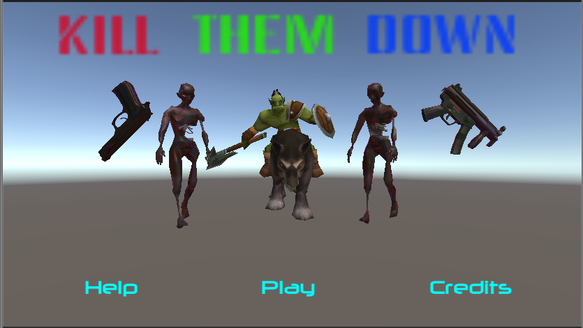
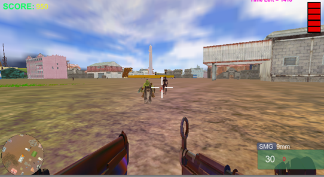
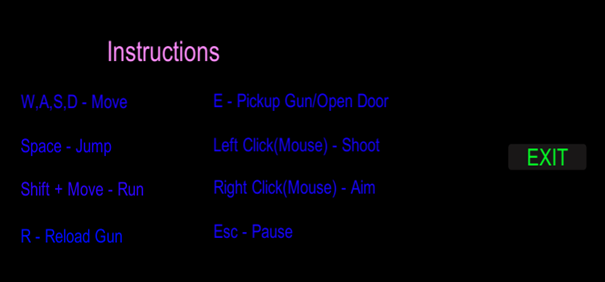

# Kill Them Down - Unity FPS Game

Kill Them Down is a thrilling first-person shooter (FPS) game originally developed in 2019 in Unity using JavaScript and C#. Set in a vibrant 3D environment, the game offers an immersive combat adventure where the player must defeat enemies and accomplish high scores. The game is designed with intuitive controls and an engaging gameplay mechanic.

## Table of Contents
1. [Features](#features)
2. [Documentation](#documentation)
3. [Scripts](#scripts)
4. [Game Language Compatibility](#game-language-compatibility)
5. [How to Download and Play](#how-to-play)
6. [Controls](#controls)

## Features
- First-person shooter perspective
- Ability to pause and resume gameplay
- In-game help menu for learning controls
- Advanced enemy AI that can attack the player when in proximity
- In-game scoring system based on enemy takedowns
- Player health management
- Time-based gameplay with timer function

## Documentation
The `Documentation` folder contains detailed markdown files explaining the design choices, development process, and evaluation of the game. It's a great resource for understanding the thought process and the steps taken to build this game.

## Scripts
The `Scripts` folder contains the JavaScript and C# scripts used to control the game logic. These scripts manage gameplay elements such as player and enemy behavior, game UI, and more.

## Game Language Compatibility
The game was initially developed using JavaScript and C# in Unity 2019. However, JavaScript (UnityScript) is deprecated in recent versions of Unity, and some scripts may not work directly if imported into Unity 2020 or later. For the best compatibility, it's recommended to use Unity 2019 to explore and edit the game's source code.

## How to Download and Play
1. Download the "Kill Them Down_Data" folder and the "Kill Them Down.exe" file from [this Google Drive link](<https://drive.google.com/drive/folders/1t2d_swQjbTlxo-m2SlLbB5pyny4haSgv?usp=sharing>).
2. Ensure that both the downloaded folder and the .exe file are kept in the same directory.
3. Open the "Kill Them Down.exe" file to start the game.

## Controls
- **W/A/S/D**: Move
- **Mouse**: Look around
- **Right Click**: Use Gun Scope
- **Left Click**: Shoot
- **Esc**: Pause/Resume Game

