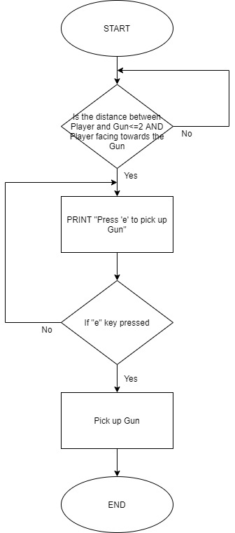
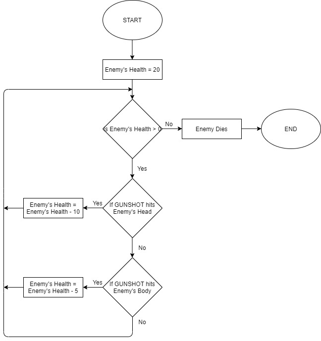
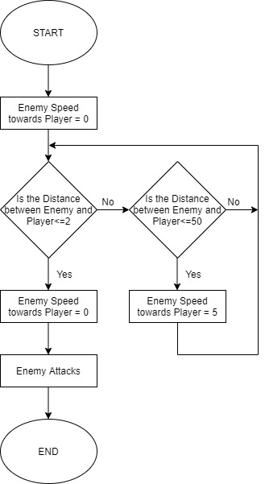
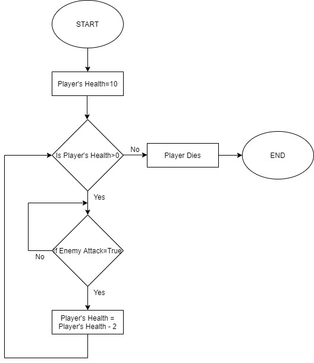
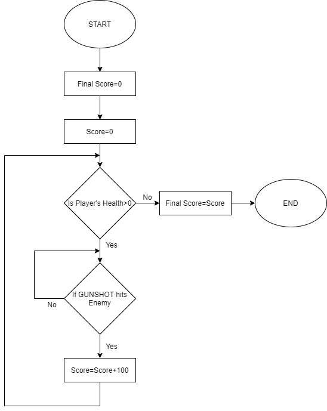
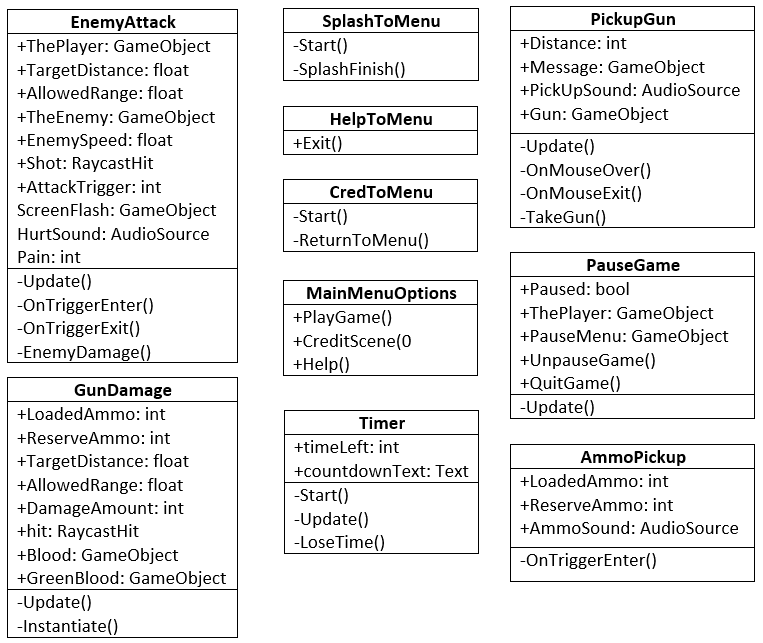
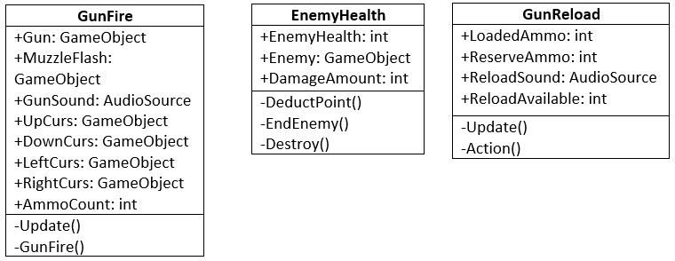

# Design Overview

## Major Elements in Unity

I will be using several elements in Unity for game development:

- **Scenes**: The base where different GameObjects are placed. There will be seven different scenes in the game, with two ('Splash Screen' and 'Credits') not requiring user input.
- **GameObjects**: All the objects used in the game, like Enemy, Building, Player, etc.
- **Canvas**: The base where all UI elements are placed. In this game, UI elements like Image, Text, and Button will be placed inside the Canvas.
- **Collider Components**: These components determine the shape of a GameObject. I will be using collider components for GameObjects such as Enemy, Gun, Ammo box, Player, Buildings, etc.

### Rough flowchart of different scenes of the game.

## System Flowcharts

Detailed flowcharts for major actions and functions available in the game are as follows:

1. Pick up gun

2. Enemy Health

3. Enemy Attack

4. Player's Health

4. Final Score

## UML Diagrams

Here are the UML Class Diagrams of the scripts that will be used in the game:

## Test Plan

I have established a test plan to ensure that the success criteria are met:

| Action to Test | Testing Method | Result (Example) |
| --- | --- | --- |
| Check that all three buttons on the Main Menu works | Double click the button on the Main Menu | When clicked 'HELP' button, 'Help' scene should appear |
| First Person Camera is functioning properly in Game Scene | Move your mouse in different directions (left, right, up or down) when entered Game Scene | When mouse is moved, the camera should also move in the same direction |
| Timer is working | Check that time on the timer of Game Scene is decreasing | The time should be 1500 at first and decrease by 1 every sec |
| Keys are functioning well in First Person mode | Press different keys on keyboard that are mentioned to be functional in the Help Scene | When pressed ‘Space’ key Player should jump, when pressed ‘w’ key Player should walk ahead |
| Player picks up gun | Press ‘e’ key when “Press ‘e’ to pick up gun” message is shown | Player should pick up gun by pressing ‘e’ key when “Press ‘e’ to pick up gun” message is shown |
| Player picks up ammo | Go and touch ammo box when seen on the ground | Player should pick up ammo when ammo box is touched and number of ammo should increase |
| Ammo decreases | Shoot the gun | Number of ammo should decrease when Player shoots the gun |
| Mouse buttons are working | Click right and left buttons of the mouse | When clicked right button Gun-Scope should be activated and when clicked left button Gun should fire |
| Score increases | Shoot the enemy with gun | When enemy gets shot by the gun, score should increase by 100 |
| Enemy dies | Shoot enemy until it falls down on the ground | Enemy falls down on the ground and dies when Player shoots enemy with gun more than 3 times |
| Enemy attacks | Go near enemy | Enemy should move towards player when distance is <50 and start attacking when distance<2 |
| Game pauses | Click ‘Esc’ key | Paused Scene should appear and game should be paused |
| Game resumes and can be quitted | Click on the ‘RESUME’ and ‘QUIT GAME’ button on the Paused Scene | Click on ‘RESUME’ button should resume the game and click on ‘QUIT GAME’ button should lead to Main Menu |
| Game over | Check that Game Over Scene appears when Player Dies | When Player’s Health reaches 0, Game Over Scene should appear |

Integration testing and user-acceptance testing will be carried out after these tests. These tests will ensure the game runs smoothly without interruptions and meets the client's requirements.

