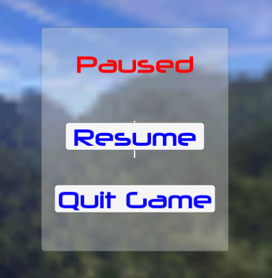
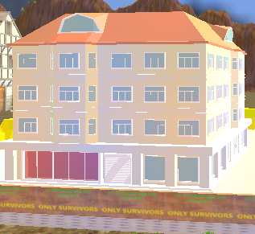
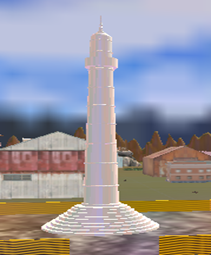
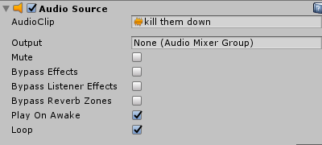
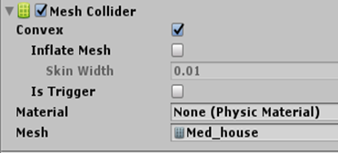

# Development

**Kill Them Down** is an offline FPS (First-Person Shooter) game developed in Unity 3D by coding scripts in JavaScript and C#. 

The major components that were used in Unity to make this game are as follows:

- Canvas (User Interface)
- 3D Assets
- Animation
- Audio
- Physics
- In-built Classes of Unity
- C# coded Classes
- JavaScript coded function
- Structure
- Nested if statement
- Else if statement
- Boolean

## Canvas (User Interface)

I have used in-game UI system of Unity in each and every scene of the game. I have used UI elements like Text, Button and Image inside the Canvas.

## 3D Assets

All the 3D objects that are seen in the game are the 3D assets. I have downloaded most of them from the Unity Assets Store. Some 3D assets that I have used are: Guns, Barrels, Towers, Castles, Buildings etc.

## Animations

In this game, I have used animations for the different actions performed by the First Person Character and Enemies. For example: Animation for reloading the gun, firing the gun, dying enemy, enemy attack and so on. I have used Animation on the main menu’s background as well.

## Audios

I have used two different kinds of audios in the game. One of them loops from the beginning of the game till the end, while another one plays when some action is carried out by the First Person Character or Enemy while playing the game.

## Physics

I have used 3D physics component in almost all the GameObjects that are available in the Game Scene to provide physical behavior to the objects. 

## In-built Classes of Unity

In most of the scripts, I have used in-built classes of Unity in order to avoid extra line of codes by creating classes myself. Some of the classes that I used are: SceneManager, Time, Coroutine.

## C# coded Classes

I have created different Classes while coding C# scripts. 

## JavaScript coded Functions

I had to use different functions while coding JavaScript scripts as JavaScript doesn’t use classes.

## Structure

Different in-built structure of Unity has been used while coding. For example: Vector3 structure has been used in the script to pass directions and positions around. Similarly, raycastHit structure has been used to receive details from the raycast.

## Control Structures

### If statement

### Nested if statement

### If else statement

## Boolean 

The class “PauseGame” is used to pause the game at any point of the Game Scene. To check whether the game is running or already paused, Boolean “Paused” is used. 

## Note

All the codes used while building this game is available in scripts folder in the root directory.