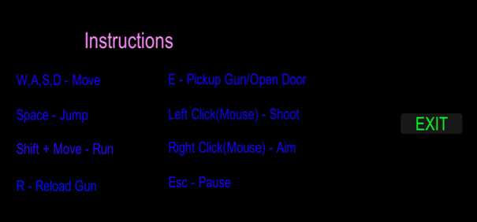

# Evaluation

## Evaluation of product on the basis of success criteria.

1. The first success criteria have been achieved as the game uses First Person Camera. 

2. Player can press ‘Esc’ key to pause the game and ‘RESUME’ button to resume the game. So, second success criteria have also been achieved.

3. Third success criteria have been attained as the user can simple go to Help Menu by clicking the Help Button on Main Menu and know the control keys.

4. As the player shoots the enemy, enemy’s health decreases and when reaches 0, enemy dies. So, forth success criteria have also been accomplished.

5. After picking up the gun, the player can right-click the mouse to use Gun-Scope. So, fifth success criteria have been fulfilled.

6. Sixth success criteria have also been achieved because when the distance between player and enemy becomes less than 2, enemy starts attacking the player.

7. The score keeps on increasing as the player shoots enemy with the gun. Therefore, seventh success criteria have also been attained.

8. When enemy attacks the player, player’s health decreases. And when reaches 0, game overs. So, eighth success criteria have been accomplished.

9. When the time reaches 0 on the timer, the game overs. Therefore, the last success criteria have also been achieved. 

## Client Feedback
The client was satisfied with the game as all his requirements (success criteria) were achieved. He was amazed when he saw Dharahara (historical monument of Nepal) in the game. I added a mini-map on the game as he suggested me to do so after doing User-Acceptance Testing. In overall, the feedbacks and problems are stated below:
1.	It takes more than 10 seconds to load the Game Scene from the Main Menu Scene. 
2.	Sometime enemy attacks through the wall.
3.	He has suggested me to add ‘Save Game’ and ‘Load Game’ option so that he can save the game and later play from the point he left last time.   
4.	He has also suggested me to add ‘Revive’ button in the Pause Scene so that he can restart the game whenever he wants without again going to the Main Menu.

## Recommendation for further development

Though all the success criteria are achieved, there are still a lot of improvement options that could be done to make the game more interesting and systematic. Some of them are:
1.	Addition of High Score Table
A High Score Table can be added to the game where top 10 high scores with the Player’s name can be saved. This can be done by using MySQL Database Management System and building connection between Unity 3D and MySQL.
2.	‘Save Game’ and ‘Load Game’ option
‘Save Game’ and ‘Load Game’ options can be added to the game so that the players can save the game at any point and later play from the same point by loading the saved game. PlayerPrefs can be used to save the game locally on the player’s device.
3.	Shooter Enemies
To make this game more complicated and interesting, enemies with gun who can shoot the player from far distance can be added. This can be done by just modifying few lines of code of the enemies that already exists in the game.